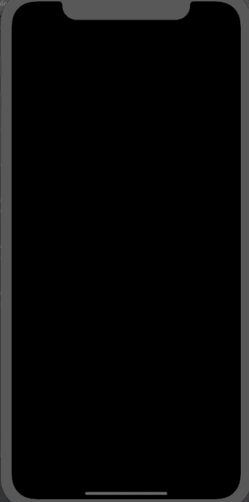

# Pollfish SDK

This is a coding kata to demonstrate the ability to show a screen over generic iOS applications

## Setup

Download the project and open the PollfishSDK.xcodeproj. Select the target for "Example" and build for an iOS device or simulator.

Make sure that the setting "Limit Ad Tracking" is turned off. This can be found from Settings > Privacy > Advertising > Limit Ad Tracking

## Tests

There are a handful of tests setup for the "PollfishSDK" target. The "Example" target also has some UI tests. Run these through Xcode.

## Usage

A precompiled version: "PollfishSDK.framework" has been included in this repo for easy use in other projects.

## Demo



## **NOTE**

When running on the phone I got the following error in xcode.

```
    Example[914:178732] [Process] kill() returned unexpected error 1
```

After googling I found the following threads that means xcode has not fixed this and it is not a problem with my application or code.


https://stackoverflow.com/questions/58321114/why-i-get-the-console-warning-process-kill-returned-unexpected-error-1-when

https://forums.developer.apple.com/thread/123782